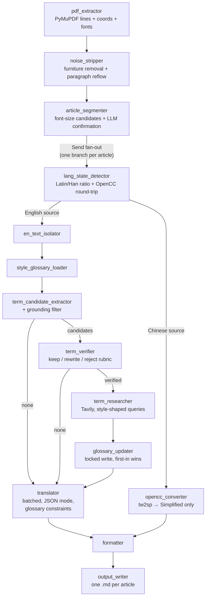

# pub2md-agent

A LangGraph agent that turns a multi-article PDF (e.g. an Economist-style
issue) into one clean, bilingual (English + Simplified Chinese) Markdown file
per article — with column-aware layout parsing, article segmentation,
web-search-backed terminology that stays consistent across every run, and a
quantitative eval against a single-shot baseline.

> Portfolio project. Full requirements and design decisions live in
> [CLAUDE.md](CLAUDE.md). Status: **Phase 4 complete** (layout fixes,
> observability, unit tests, docs). Planned Phase 5: LaTeX formula
> extraction and table handling.

## Quickstart

```bash
# deps: langgraph, langchain-openai, pymupdf, python-dotenv, pydantic,
#       opencc-python-reimplemented (+ tavily for terminology research)
cp .env.example .env   # pick a provider block and fill in the API keys
python -m src.cli path/to/issue.pdf --style economist   # or: academy
```

One `.md` file per detected article lands in `outputs/`; the run ends with a
summary (files, failures, newly researched glossary terms, token usage and
estimated cost) and a structured record in `logs/`.

## Architecture



- **Error policy** (spec 5.3): no text layer → abort the whole run; a failing
  translation batch → 2 retries then `[translation failed]` degradation per
  paragraph; failed term search → LLM best guess tagged `llm_fallback` and
  flagged for review in the summary.
- **Parallelism**: article branches run concurrently under LangGraph `Send`;
  branch output is restricted to reducer fields (`output_schema`) and the
  glossary file is written under an exclusive lock.
- **Cost control**: batched translation with bounded prompts/max_tokens,
  glossary constraints filtered to terms present in the article, search
  snippets trimmed before entering context, per-run token/cost accounting.
- **Terminology quality gates**: term extraction is recall-oriented, so a
  deterministic grounding filter (the candidate must occur verbatim in the
  article) and a keep/rewrite/reject verifier rubric gate every candidate
  before any web search is spent on it. `python -m scripts.audit_glossary`
  re-judges already-researched glossary entries with the same rubric and
  archives rejects reversibly to `glossary_<style>_rejected.json`.

## Evaluation (spec §7)

`python -m eval.run_eval` runs every item in `eval/manifest.json` through the
full agent and a baseline — raw extracted text, one generic "translate this"
prompt, no cleaning/segmentation/glossary. Measured on the 5-PDF test set
(4-article magazine issue, two news PDFs, one Traditional-Chinese article,
one academic paper):

| Metric | Agent | Baseline |
|---|---|---|
| Terminology consistency (corpus, headline) | **81.8%** (33 terms, strict all-occurrences) | 0% |
| Multi-article split accuracy | 5/5 | 4/5 (cannot split) |
| Glossary adherence per occurrence | 0.94–1.00 (175 occurrences) | 0.00–0.89 |
| LLM-judge accuracy (1–5) | 4.2–4.8 | 1.0–3.0 |
| Failed paragraphs | 0 | — |

The consistency denominator grew from 14 to 33 multi-occurrence terms after
the glossary quality audit (more real, recurring terms are now measured); a
term counts as consistent only if *every* occurrence uses the glossary
rendering.

Caveats: the judge is the same model family as the translator (self-grading
bias), and baseline adherence is doc-level because a single blob offers no
paragraph alignment. Paragraph-boundary F1 activates per item once a
hand-checked reference exists at `eval/references/<pdf-stem>.txt`.

## Design decisions & pitfalls (the honest section)

Things that broke on real PDFs and shaped the current design:

1. **CJK-ratio filtering fails on brand names.** The embedded Chinese
   translation of one article was full of Latin names ("Bending Spoons",
   "Corriere della Sera"), diluting the CJK character ratio below any sane
   threshold. Fix: English source lines never contain Han ideographs, so a
   single Han char marks a translation line — ratio kept only as fallback.
2. **`Send` fan-out state collisions.** Parallel article branches writing
   plain keys (`style`) back to the parent raised
   `InvalidUpdateError`. Fix: compile the article subgraph with an
   `output_schema` restricted to reducer fields.
3. **DeepSeek JSON mode is not actually safe.** A translation ending with a
   Chinese closing quote (`”`) deterministically loses its ASCII closing
   quote — reproducible byte-for-byte, so retries cannot help. Fix: a small
   tail-repair parser (`src/tools/llm_json.py`); the targeted repair must
   run before blind suffix appends or the stray brace leaks into the
   translation (caught by a unit test).
4. **Invisible whitespace defeats sentence logic.** Trailing NBSP (`\xa0`)
   made mid-sentence lines look sentence-final and broke cross-page
   paragraph stitching. Fix: whitespace normalization at extraction time.
5. **PyMuPDF splits one visual row at font changes.** Italic names ("David
   *Dorn*") arrive as separate line objects; both the short-line paragraph
   rule and column clustering had to learn that a row advance is required
   before splitting.
6. **One median line-gap is not enough.** A 30pt title is spaced ~36pt while
   12pt body sits at ~14pt; paragraph-gap thresholds are computed per font
   size. Documents with uniform spacing (Chinese justified text) signal
   paragraphs only via a short previous line — that rule adapts to the
   column's right-edge raggedness so news PDFs don't over-split.
7. **Heading signals are two different things.** Oversized fonts mark
   *article boundaries*; body-font crossheads ("Ridin' dirty") are
   *rendering* signals only. Conflating them once let the confirmation LLM
   split one article in two. Now only `font_heading` paragraphs are
   segmentation candidates.
8. **Note-app exports burn UI into the PDF.** Property labels
   ("Status/Archive/Pin") plus their same-row values, and tiny-font print
   footers, are stripped structurally (label rows, font far below body
   median) rather than by content heuristics.
9. **Recall-oriented term extraction floods the glossary with junk.** The
   single-call extractor nominated everyday collocations ("state failure",
   "crowd control"), one-off rhetoric ("American carnage") and rhetorical
   wrappers ("cradle of the Confederacy" instead of "Confederacy") — 40+ of
   105 researched entries failed a later audit. Fix: a generate–critique
   split. A deterministic grounding gate kills hallucinations (the term must
   literally occur in the article), then a `term_verifier` node judges each
   candidate against a keep/rewrite/reject rubric before any web search is
   spent on it. The same rubric powers `scripts/audit_glossary.py`, which
   retro-cleaned the glossary (rejected entries are archived, not deleted).

## Testing & observability

- `python -m pytest tests/` — 42 tests over the pure layout logic
  (clustering, reflow, noise predicates), the JSON repair parser, the
  glossary store (locking, first-in-wins), and the eval metrics.
- Every CLI run writes `logs/run-<timestamp>.json` (provider/model, per
  article results, new terms, errors, tokens, cost, duration).
- Set `LANGSMITH_TRACING=true` (+ API key) in `.env` for full step-level
  traces — no code changes required.

## Known limitations

- Formulas are extracted as glyph text and passed through verbatim (not
  translated, not LaTeX); tables are not detected and their cells may reflow
  into odd paragraphs. Both are scheduled for Phase 5.
- Scanned/image PDFs are explicitly out of scope (the run aborts).
- The LLM-judge shares a model family with the translator; treat its scores
  as relative (agent vs baseline), not absolute quality.
