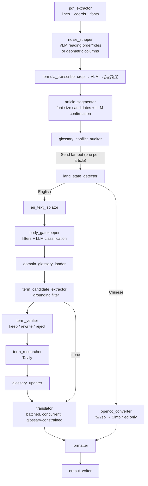

# pub2md-agent

A LangGraph agent that turns a PDF — an Economist-style issue, a news
export, an academic paper, a Traditional-Chinese article — into clean
bilingual (English + Simplified Chinese) Markdown notes, one file per
article.

What it actually does beyond "call an LLM":

- **Reads the page, not the byte stream.** PyMuPDF gives lines with
  coordinates and fonts; a vision model is used only to decide the *reading
  order and role* of each text block, which fixes two-column interleaving
  without any transcription risk.
- **Keeps only the note.** Title, body text and display formulas. Author
  blocks, captions, footnotes, references and journal furniture are removed
  by deterministic filters plus an LLM gatekeeper.
- **Terminology that stays consistent across runs.** Per-domain glossaries
  grown from web search, gated by a grounding filter and a
  keep/rewrite/reject rubric before any search is spent, then enforced
  during translation.
- **Two independent axes.** Base style (tone/layout) × glossary domains, so
  an academic paper can be translated with the cs *and* pm vocabularies.
- **Measured, not asserted.** `eval/` scores the agent against a
  single-shot baseline: terminology consistency 81.8% vs 0%, multi-article
  split 5/5 vs 4/5, LLM-judge 4.2–4.8 vs 1.0–3.0. Last full run was on the
  v2 pipeline, and the judge shares a model family with the translator —
  the harness is being overhauled and re-run before the v3 release, so read
  these as relative, not current.

Status: v1 (agent) and v2 (web app) are live; v3 is in progress locally.
See [CHANGELOG.md](CHANGELOG.md) and [ROADMAP.md](ROADMAP.md).

## How to use it

The web app is at **https://pub2md.duckdns.org** — access is limited to two
accounts, ask the owner for one.

1. Log in. Each account allows one active session; logging in elsewhere
   signs the other device out.
2. Pick a **base style** (economist / academy) and one or more **glossary
   domains** (econ / cs / pm). Domains are ordered — when two domains
   translate the same term differently, the one you selected first wins and
   the conflict is reported with the result.
3. Optionally tick **Refine translation** for a second review-and-rewrite
   pass (better prose, roughly double the translation cost and time).
4. Upload a PDF (limits: 25 MB, 100 pages) and watch the progress bar.
5. Preview each article in the browser (Markdown + KaTeX math) and download
   all of them as a zip.

Recent jobs stay in the history list; **Clear history** removes them, and
anything older than the retention window is deleted automatically.

## Project structure

```text
src/                        Agent core (LangGraph)
├── agent/graph.py          Main graph + per-article subgraph, Send fan-out
├── agent/nodes/            One file per pipeline node
├── agent/state.py          Typed state; reducers keep parallel branches apart
├── tools/                  PDF layout, VLM layout, glossary store, filters,
│                           JSON repair, progress, web search
├── prompts/*_style.md      Base-style prompts (a new file = a new style)
├── styles.py               Single source of truth for base styles × domains
├── config.py               Prefix-scoped provider config (LLM_* / VLM_*)
└── cli.py                  Command-line entry point
webapp/                     Django 5 thin shell — HTTP, auth, jobs, files only
├── config/                 settings / urls / wsgi (reads the repo-root .env)
├── jobs/                   Job model, thread-pool executor, JSON API, sweeps
├── accounts/               Two rotatable accounts, single active session
├── templates/, static/     Single-page UI (vanilla JS, marked + KaTeX)
└── manage.py
data/                       glossary_<domain>.json seeds + _rejected archives
                            (glossary.db is generated, not tracked)
eval/                       run_eval.py, metrics.py, manifest.json, test PDFs
scripts/audit_glossary.py   Re-judge glossary entries against the term rubric
tests/                      pytest suite — pure logic, no API spend
deploy/                     nginx.conf, pub2md.service (copied to the droplet)
.env.example                Every environment variable, with defaults
pyproject.toml              Dependencies + pytest/Django configuration
README.md / ROADMAP.md / CHANGELOG.md
```

Pipeline (see the docstring in `src/agent/graph.py` for the exact edges):


```mermaid
flowchart TD
    A[pdf_extractor<br/>lines + coords + fonts] --> B[noise_stripper<br/>VLM reading order/roles<br/>or geometric columns]
    B --> FT[formula_transcriber<br/>crop → VLM → $$LaTeX$$]
    FT --> C[article_segmenter<br/>font-size candidates + LLM confirmation]
    C --> GC[glossary_conflict_auditor]
    GC -- "Send fan-out (one per article)" --> D[lang_state_detector]
    D -- English --> E[en_text_isolator] --> BG[body_gatekeeper<br/>filters + LLM classification]
    BG --> F[domain_glossary_loader] --> G[term_candidate_extractor<br/>+ grounding filter]
    G --> V[term_verifier<br/>keep / rewrite / reject] --> H[term_researcher<br/>Tavily] --> I[glossary_updater]
    I --> J[translator<br/>batched, concurrent, glossary-constrained]
    G -- none --> J
    D -- Chinese --> K[opencc_converter<br/>tw2sp → Simplified only]
    J --> L[formatter] --> M[output_writer]
    K --> L
```

## Developer guide

### Where it runs

| | |
|---|---|
| Live app | https://pub2md.duckdns.org |
| Host | DigitalOcean droplet (Ubuntu 24.04), repo at `/opt/pub2md-agent` |
| Stack | nginx → gunicorn (**1 worker**) → Django; TLS via certbot; systemd unit `pub2md` |
| Data | `data/glossary.db`, `webapp/db.sqlite3`, job files in `var/` — all on the droplet disk |
| Config artifacts | `deploy/nginx.conf`, `deploy/pub2md.service` |

The droplet disk persists across reboots and `git pull` deploys — the
"wiped on redeploy" hazard only applies to container platforms. Job files
are deleted after `PUB2MD_JOB_RETENTION_DAYS`; the glossary DB is worth
backing up, it holds terms grown over many runs.

### Local development

The dev machine uses the conda env `elen_ai_agent` — never create a
`.venv` here (the server uses one, the dev machine does not).

```bash
cp .env.example .env   # pick a provider block, fill in the keys
```

```bash
/opt/homebrew/Caskroom/miniconda/base/envs/elen_ai_agent/bin/python -m src.cli "eval/test_articles/Attention is All You Need.pdf" --base-style academy --domains cs
```

`--domains` accepts several values in precedence order and defaults to the
base style's usual pairing; add `--refine` for the second translation pass.
Output lands in `outputs/` (one `.md` per article), with a run summary on
stdout and a structured record in `logs/run-<timestamp>.json`.

Web app locally:

```bash
/opt/homebrew/Caskroom/miniconda/base/envs/elen_ai_agent/bin/python webapp/manage.py runserver 8642 --noreload
```

Then open http://127.0.0.1:8642/. `--noreload` is deliberate: the reloader
duplicates the job executor, and the template cache means a restart is
needed after editing templates anyway. Create a throwaway login with
`manage.py rotate_accounts` (prints the passwords once).

Tests and tooling:

```bash
/opt/homebrew/Caskroom/miniconda/base/envs/elen_ai_agent/bin/python -m pytest -q
```

```bash
/opt/homebrew/Caskroom/miniconda/base/envs/elen_ai_agent/bin/python -m scripts.audit_glossary --domain cs --dry-run
```

- `python -m pytest -q` — 155 tests over layout logic, filters, the JSON
  repair parser, the glossary store, term gating, progress and the eval
  metrics. No API keys needed, no spend.
- `python -m eval.run_eval [--skip-judge|--skip-baseline|--only <substr>]`
  — agent vs single-shot baseline over `eval/manifest.json`.
- `python -m scripts.audit_glossary --domain <d> [--dry-run]` — re-judges
  researched entries; rejects are archived to
  `data/glossary_<domain>_rejected.json`, never deleted.

### First-time server setup

Only needed when rebuilding the droplet from scratch. Every step is manual.

1. **Droplet & DNS** — an Ubuntu 24.04 basic droplet ($6/mo tier is enough).
   Point the domain at its public IP: this project uses a free DuckDNS
   subdomain, so set `current ip` in the DuckDNS panel and click *update
   ip* (a registrar domain works too — add an A record instead). Then, as
   root: `adduser pub2md && usermod -aG sudo pub2md` and
   `apt update && apt install -y python3.12-venv nginx certbot python3-certbot-nginx git`.
2. **Code & env** — as the `pub2md` user, clone into `/opt/pub2md-agent`,
   then `python3 -m venv .venv` and `.venv/bin/pip install -e .` plus
   `tavily-python` (and `pytest-django` if you want to run tests there).
   The server uses a plain venv; the conda env is a dev-machine thing.
3. **Configuration** — `cp .env.example .env`, fill in the provider keys
   plus `DJANGO_DEBUG=false`, a generated `DJANGO_SECRET_KEY`,
   `DJANGO_ALLOWED_HOSTS` and `DJANGO_CSRF_TRUSTED_ORIGINS` for the domain,
   and the budget guards. `chmod 600 .env`.
4. **Django one-time** — from `webapp/`: `manage.py migrate`,
   `collectstatic --noinput`, `createsuperuser` (for `/admin`), and
   `rotate_accounts`, which prints the guest passwords **once** — hand them
   out over a side channel, never through the app.
5. **Services** — copy `deploy/pub2md.service` to
   `/etc/systemd/system/`, enable it, copy `deploy/nginx.conf` to
   `/etc/nginx/sites-available/pub2md`, symlink it into `sites-enabled`,
   remove the default site, `nginx -t && systemctl reload nginx`, then
   `certbot --nginx -d <domain>` for TLS. Keep gunicorn at `--workers 1`.
6. **Smoke test** — the checks in the next section.

### Verifying on the server

After an update, or whenever the droplet has been touched:

```bash
sudo systemctl status pub2md && journalctl -u pub2md -n 50 --no-pager
```

Then in a browser: load https://pub2md.duckdns.org, log in, upload a small
PDF, watch the progress bar move, check that formulas render in the
preview, and download the zip. Logging in from a second browser with the
same account must sign the first one out.

### Updating the server

There is no CI/CD — nothing reaches production without these commands.
Push locally first, then on the droplet:

```bash
cd /opt/pub2md-agent && git pull
```

```bash
.venv/bin/pip install -e .
```

```bash
cd /opt/pub2md-agent/webapp && ../.venv/bin/python manage.py migrate && ../.venv/bin/python manage.py collectstatic --noinput
```

```bash
sudo systemctl restart pub2md
```

`pip install -e .` is only needed when dependencies changed; `migrate` only
when a migration was added; `collectstatic` only when `webapp/static/`
changed. `systemctl restart` is always needed.

### Q&A

**How does configuration reach the app?** Everything comes from a single
`.env` at the repo root. `webapp/config/settings.py` calls
`load_dotenv(REPO_ROOT / ".env")` itself, so the CLI and the web app always
read the same file — there is no separate Django config, and no `.env` in
`webapp/`.

**How do I switch model provider?** Set `LLM_PROVIDER=<name>` and fill in
`<NAME>_MODEL` / `<NAME>_API_KEY` / `<NAME>_BASE_URL`. The config reads by
prefix, so any OpenAI-compatible provider works without code changes. The
vision model is a separate `VLM_*` block and may point somewhere else
entirely.

**Which variables matter?**

| Variable | Effect |
|---|---|
| `LLM_PROVIDER`, `<PREFIX>_MODEL/_API_KEY/_BASE_URL` | translation model (required) |
| `TAVILY_API_KEY` | terminology research; without it new terms fall back to an LLM guess |
| `VLM_MODEL/_API_KEY/_BASE_URL` | vision model — formula transcription **and** layout ordering. Unset ⇒ both features off, the run still works |
| `VLM_LAYOUT=off` | keep the VLM for formulas but force geometric column parsing |
| `TRANSLATE_CONCURRENCY`, `VLM_LAYOUT_CONCURRENCY` | parallelism (defaults 4) |
| `DJANGO_DEBUG/_SECRET_KEY/_ALLOWED_HOSTS/_CSRF_TRUSTED_ORIGINS` | production Django settings |
| `PUB2MD_MAX_UPLOAD_MB`, `PUB2MD_MAX_PDF_PAGES` | upload guards (25 / 100) |
| `PUB2MD_MONTHLY_BUDGET_USD` | spend ceiling; uploads get HTTP 429 once reached |
| `PUB2MD_JOB_RETENTION_DAYS`, `PUB2MD_JOB_STALE_MINUTES` | history sweep, orphan detection |
| `PUB2MD_ACCOUNTS` | account names for `manage.py rotate_accounts` |
| `LANGSMITH_TRACING=true` (+ key) | full step-level traces, no code changes |

**Why only one gunicorn worker?** Jobs run in an in-process thread pool and
the budget check is in-process too. Scale threads, not workers — a second
worker would run duplicate jobs and double-count spend.

**KaTeX and marked come from a CDN.** `webapp/templates/index.html` loads
them from jsdelivr. If an audience can't reach it, math and Markdown
preview silently degrade. Vendoring them into `webapp/static/` is a
scheduled roadmap item.

**Where does the glossary live?** `data/glossary.db` (generated, not in
git) auto-seeds on first connect from the versioned
`data/glossary_<domain>.json` files. Editing a seed JSON and deleting the
DB is a valid reset; hand-editing the DB is not tracked by anything.

**Test PDFs.** `eval/test_articles/` holds copyrighted source material and
is no longer tracked for new files — put your own samples there and list
them in `eval/manifest.json`.

**A model returns broken JSON.** Known and handled: DeepSeek's JSON mode
deterministically drops the closing quote when a value ends with a Chinese
quotation mark. `src/tools/llm_json.py` repairs it; retries cannot, because
the failure is byte-for-byte reproducible.
