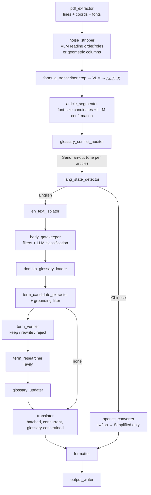

# pub2md-agent

A LangGraph agent that turns a PDF — an Economist-style issue, a news
export, an academic paper, a Traditional-Chinese article — into clean
bilingual (English + Simplified Chinese) Markdown notes, one file per
article. Hand it a `.md` file instead and it returns a Chinese-only
translation with the document's structure untouched.

What it actually does beyond "call an LLM":

- **Reads the page, not the byte stream.** PyMuPDF gives lines with
  coordinates and fonts; a vision model is used only to decide the *reading
  order and role* of each text block, which fixes two-column interleaving
  without any transcription risk.
- **Keeps only the note.** Title, body text and display formulas. Author
  blocks, captions, footnotes, references and journal furniture are removed
  by deterministic filters plus an LLM gatekeeper.
- **Terminology that stays consistent across runs.** Per-domain glossaries
  grown from web search, gated by a grounding filter and a
  keep/rewrite/reject rubric before any search is spent, then enforced
  during translation. New terms enter as candidates and only become
  authoritative through an audit that regenerates the versioned seed files.
- **Two independent axes.** Base style (tone/layout) × glossary domains, so
  an academic paper can be translated with the cs *and* pm vocabularies —
  or with no glossary at all when the source is general prose.
- **Measured, not asserted.** `eval/` scores the agent against a
  single-shot baseline: terminology consistency 81.8% vs 0%, multi-article
  split 5/5 vs 4/5, LLM-judge 4.2–4.8 vs 1.0–3.0. Last full run was on the
  v2 pipeline, and the judge shares a model family with the translator —
  the harness is being overhauled and re-run before the v3 release, so read
  these as relative, not current.

Status: v1 (agent) and v2 (web app) are done; v3 is in progress. It runs on
your own machine. See [CHANGELOG.md](CHANGELOG.md) and
[ROADMAP.md](ROADMAP.md).

## How to use it

Two front ends over one pipeline: the CLI (see the developer guide) and a
local web app — start it with the `runserver` command below and open
http://127.0.0.1:8642/.

1. With `PUB2MD_AUTH=off` (the local setting) the page opens straight into
   the tool. With the login wall on, sign in with an account from
   `manage.py rotate_accounts`; each account allows one active session, so
   logging in elsewhere signs the other device out. **How to Use** in the
   tool card summarises the rest of this list.
2. Upload a PDF (limits: 100 MB, 500 pages) and watch the progress bar. A
   `.md` file works too: it is translated in place — same headings, tables,
   code blocks and links, Chinese only, one file out.
3. Pick a **translation style**: `economist` (journalism), `academy`
   (papers) or `general` (neutral written Chinese for anything else).
4. Pick any number of **glossary domains** (econ / cs / pm) to force
   consistent terminology. Domains are ordered — when two disagree on a
   term, the one selected first wins and the conflict is reported with the
   result. Selecting none translates without a glossary, which is what
   `general` preselects.
5. **Translate** runs one pass; **Refined Translation** adds a second
   review-and-rewrite pass — better prose, roughly double the cost and time.
6. Preview each article in the browser (Markdown + KaTeX math) and download
   all of them as a zip.

Recent jobs stay in the history list; **Clear history** removes them, and
anything older than the retention window is deleted automatically.

## Project structure

```text
src/                        Agent core (LangGraph)
├── agent/graph.py          Main graph + per-article subgraph, Send fan-out
├── agent/nodes/            One file per pipeline node
├── agent/state.py          Typed state; reducers keep parallel branches apart
├── tools/                  PDF layout, VLM layout, markdown fences, glossary
│                           store, filters, JSON repair, progress, search
├── prompts/*_style.md      Base-style prompts (a new file = a new style)
├── styles.py               Single source of truth for base styles × domains
├── config.py               Prefix-scoped provider config (LLM_* / VLM_*)
└── cli.py                  Command-line entry point
webapp/                     Django 5 thin shell — HTTP, auth, jobs, files only
├── config/                 settings / urls / wsgi (reads the repo-root .env)
├── jobs/                   Job model, thread-pool executor, JSON API, sweeps
├── accounts/               Two rotatable accounts, single active session
├── templates/, static/     Single-page UI (vanilla JS); static/vendor/
│                           holds marked + KaTeX, no CDN at runtime
└── manage.py
data/                       glossary_<domain>.json seeds + _rejected archives
                            (glossary.db is generated, not tracked)
eval/                       run_eval.py, metrics.py, manifest.json, test PDFs
scripts/audit_glossary.py   Re-judge glossary entries against the term rubric
tests/                      pytest suite — pure logic, no API spend
deploy/                     nginx + systemd, parked for a future deployment
.env.example                Every environment variable, with defaults
pyproject.toml              Dependencies + pytest/Django configuration
README.md / ROADMAP.md / CHANGELOG.md
```

Pipeline (see the docstring in `src/agent/graph.py` for the exact edges):


```mermaid
flowchart TD
    A[pdf_extractor<br/>lines + coords + fonts] --> B[noise_stripper<br/>VLM reading order/roles<br/>or geometric columns]
    B --> FT[formula_transcriber<br/>crop → VLM → $$LaTeX$$]
    FT --> C[article_segmenter<br/>font-size candidates + LLM confirmation]
    C --> GC[glossary_conflict_auditor]
    GC -- "Send fan-out (one per article)" --> D[lang_state_detector]
    D -- English --> E[en_text_isolator] --> BG[body_gatekeeper<br/>filters + LLM classification]
    BG --> F[domain_glossary_loader] --> G[term_candidate_extractor<br/>+ grounding filter]
    G --> V[term_verifier<br/>keep / rewrite / reject] --> H[term_researcher<br/>Tavily] --> I[glossary_updater]
    I --> J[translator<br/>batched, concurrent, glossary-constrained]
    G -- none --> J
    D -- Chinese --> K[opencc_converter<br/>tw2sp → Simplified only]
    J --> L[formatter] --> M[output_writer]
    K --> L
```

## Developer guide

### Where it runs

On your own machine: the CLI directly, the web app under `manage.py
runserver`. State lives in `data/glossary.db`, `webapp/db.sqlite3` and job
files under `var/`, none of it in git. Job files are deleted after
`PUB2MD_JOB_RETENTION_DAYS`; the glossary DB is the one worth backing up,
it holds terms grown over many runs. Nothing is fetched from a CDN — KaTeX
and marked are vendored in `webapp/static/vendor/`, so maths renders
offline.

`deploy/` (nginx + systemd) and the `server` extra in `pyproject.toml` are
parked, not current: no hosted instance exists today, nothing local reads
them, and they are kept for whenever one is set up again.

### Local development

The dev machine uses the conda env `elen_ai_agent` — never create a
`.venv` here.

```bash
cp .env.example .env   # pick a provider block, fill in the keys
```

```bash
/opt/homebrew/Caskroom/miniconda/base/envs/elen_ai_agent/bin/python -m src.cli "eval/test_articles/Attention is All You Need.pdf" --base-style academy --domains cs
```

`--domains` accepts several values in precedence order and defaults to the
base style's usual pairing; pass it with no value to translate without a
glossary. Add `--refine` for the second translation pass.
Output lands in `outputs/` (one `.md` per article), with a run summary on
stdout and a structured record in `logs/run-<timestamp>.json`.

The same entry point handles Markdown — the suffix picks the path, and the
output is `<name>-zh.md`, Chinese only, structure preserved:

```bash
/opt/homebrew/Caskroom/miniconda/base/envs/elen_ai_agent/bin/python -m src.cli notes/handbook.md --base-style academy --domains cs
```

Web app locally:

```bash
/opt/homebrew/Caskroom/miniconda/base/envs/elen_ai_agent/bin/python webapp/manage.py runserver 8642 --noreload
```

Then open http://127.0.0.1:8642/. `--noreload` is deliberate: the reloader
duplicates the job executor, and the template cache means a restart is
needed after editing templates anyway. Create a throwaway login with
`manage.py rotate_accounts` (prints the passwords once).

Tests and tooling:

```bash
/opt/homebrew/Caskroom/miniconda/base/envs/elen_ai_agent/bin/python -m pytest -q
```

```bash
/opt/homebrew/Caskroom/miniconda/base/envs/elen_ai_agent/bin/python -m scripts.audit_glossary --domain cs --dry-run
```

- `python -m pytest -q` — 196 tests over layout logic, filters, the JSON
  repair parser, the glossary store, term gating, the Markdown fences,
  progress and the eval metrics. No API keys needed, no spend.
- `python -m eval.run_eval [--skip-judge|--skip-baseline|--only <substr>]`
  — agent vs single-shot baseline over `eval/manifest.json`.
- `python -m scripts.audit_glossary --domain <d> [--dry-run]` — re-judges
  researched entries; rejects are archived to
  `data/glossary_<domain>_rejected.json`, never deleted.

### Keeping the glossary authoritative

Terms researched during a run are stored as **candidates**: every run uses
them, but they are not authoritative until they pass the rubric and your own
review. Approved terms live in the version-controlled seed JSONs, which are
the release artifact. The loop:

```bash
/opt/homebrew/Caskroom/miniconda/base/envs/elen_ai_agent/bin/python -m scripts.audit_glossary --candidates --domain cs --dry-run
```

Drop `--dry-run` to apply: keeps are promoted to approved, rejects are
removed and archived. Then regenerate the seed JSON and commit it — a
changed seed file's hash triggers an incremental re-import on the next
connect.

```bash
/opt/homebrew/Caskroom/miniconda/base/envs/elen_ai_agent/bin/python -m scripts.audit_glossary --regenerate-seed --domain cs
```

`manage.py export_candidates --output batch.json`, the login-protected
`GET /api/glossary/candidates` and `audit_glossary --import-batch <file>`
move candidates between installations. With a single local store there is
nothing to move; they are kept for the day there is a second one.

### Q&A

**How does configuration reach the app?** Everything comes from a single
`.env` at the repo root. `webapp/config/settings.py` calls
`load_dotenv(REPO_ROOT / ".env")` itself, so the CLI and the web app always
read the same file — there is no separate Django config, and no `.env` in
`webapp/`.

**How do I switch model provider?** Set `LLM_PROVIDER=<name>` and fill in
`<NAME>_MODEL` / `<NAME>_API_KEY` / `<NAME>_BASE_URL`. The config reads by
prefix, so any OpenAI-compatible provider works without code changes. The
vision model is a separate `VLM_*` block and may point somewhere else
entirely.

**Which variables matter?**

| Variable | Effect |
|---|---|
| `LLM_PROVIDER`, `<PREFIX>_MODEL/_API_KEY/_BASE_URL` | translation model (required) |
| `TAVILY_API_KEY` | terminology research; without it new terms fall back to an LLM guess |
| `VLM_MODEL/_API_KEY/_BASE_URL` | vision model — formula transcription **and** layout ordering. Unset ⇒ both features off, the run still works |
| `VLM_LAYOUT=off` | keep the VLM for formulas but force geometric column parsing |
| `TRANSLATE_CONCURRENCY`, `VLM_LAYOUT_CONCURRENCY` | parallelism (defaults 4) |
| `PUB2MD_AUTH` | `off` drops the login wall for a local run; refused when `DJANGO_DEBUG=false` |
| `DJANGO_DEBUG/_SECRET_KEY/_ALLOWED_HOSTS/_CSRF_TRUSTED_ORIGINS` | Django settings for serving it to others |
| `PUB2MD_MAX_UPLOAD_MB`, `PUB2MD_MAX_PDF_PAGES` | upload guards (100 / 500) |
| `PUB2MD_MONTHLY_BUDGET_USD` | spend ceiling; uploads get HTTP 429 once reached |
| `PUB2MD_JOB_RETENTION_DAYS`, `PUB2MD_JOB_STALE_MINUTES` | history sweep, orphan detection |
| `PUB2MD_ACCOUNTS` | account names for `manage.py rotate_accounts` |
| `LANGSMITH_TRACING=true` (+ key) | full step-level traces, no code changes |

**Why must the web app be a single process?** Jobs run in an in-process
thread pool and the budget check is in-process too — a second process would
run duplicate jobs and double-count spend. That is what `runserver
--noreload` gives you; anything else (gunicorn, uvicorn) must be pinned to
one worker and scaled with threads.

**Do I have to log in?** Not locally: `PUB2MD_AUTH=off` skips the login wall
and the one-session-per-account rule. The switch is refused whenever
`DJANGO_DEBUG=false`, so an instance configured to be served always has a
wall — an open pub2md would hand strangers the API keys in your `.env`.

**Does anything load from the internet?** No. marked 12.0.2 and KaTeX
0.16.11 (woff2 fonts only, ~630 KB) live in `webapp/static/vendor/`. The
page makes no external request, so maths renders on a plane.

**Where does the glossary live?** `data/glossary.db` (generated, not in
git) imports the versioned `data/glossary_<domain>.json` seeds whenever
their hash changes, marking them approved; terms grown at runtime stay
candidates until audited. Editing a seed JSON is the supported way in — the
next connect picks it up. Hand-editing the DB is tracked by nothing and
will be overwritten by the next seed import.

**Test PDFs.** `eval/test_articles/` holds copyrighted source material and
is no longer tracked for new files — put your own samples there and list
them in `eval/manifest.json`.

**A model returns broken JSON.** Known and handled: DeepSeek's JSON mode
deterministically drops the closing quote when a value ends with a Chinese
quotation mark. `src/tools/llm_json.py` repairs it; retries cannot, because
the failure is byte-for-byte reproducible.
